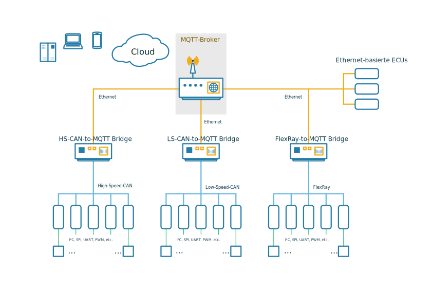

**[Introduction](#introduction)** |
**[MQTT-based E/E architecture](#mqtt-based-e/e-architecture)** |
**[Prerequisites](#prerequisites)** |
**[Installation](#installation)** |
**[To-Do](#to-do)**

# HSmartKArt-EE

**HSmartKArt-EE** provides an approach for mastering the challenges of future vehicle systems.
Connected Cars, autonomous driving and other functions that will shape the future of cars all
rely on cloud-based services. Accordingly cross-domain communication is a demanding topic for
future vehicle systems. Additionally a centralized, zone-oriented topology is key to modern
E/E architectures. Core piece of this E/E architecture is the MQTT protocol.

The HSmartKArt is an electrical powered recumbent bike based on the commercially available
e.Go Kart. The functionality e.Go Kart will be expanded consecutively with driver assistance
systems. The E/E architecture providing the foundation for modern driver assitance systems and
other future vehicle systems is called HSmartKArt-EE and provided in this repository. It is
a reference deployment of an more generic design for an modern E/E architecture that is
briefly described in section 'MQTT-based E/E architecture'.

## Disclaimer

This software is not intended for use in public areas. It is just the subject of a study.

## Introduction

This repository is a reference deployment of an E/E architecture for future vehicle systems.
The MQTT/CAN Bridge publishes CAN data that will be distributed by the MQTT Broker. Receiving
the CAN data is done by subscribing to the corresponding topic. Key components of this
reference deployment are:

* **MQTT/CAN Bridge**: MQTT client running on a Raspberry Pi with a CAN HAT. This device
  listens directly on the CAN bus. It grabs CAN frames and publishes them. So this is
  essentially a MQTT/CAN Bridge.

* **MQTT Broker**: A public MQTT broker (broker.hivemq.com) handling the distribution of
  messages throughout the connected clients.

* **Ubuntu Server**: A Host PC running a Jupyter Notebook Web Server. This can be used as a
  Workstation to visualize and analyze the CAN data.

## MQTT-based E/E architecture

Considering future vehicle systems following requirements are applying for E/E architectures:
1. Modulare, centralized topology
2. Efficient hardware and protocols
3. Cross-domain communication
4. Scalability

Based on this criteria the following design has been elaborated:

The reference deployment using Raspberry Pis as MQTT Bridges, a Laptop as Ubuntu Server and the
broker.hivemq.com as MQTT Broker has the following structure:

## Prerequisites

For the **MQTT/CAN Bridge** component a Raspberry Pi with a CAN HAT is needed. Alternatively a
similar device running a Debian-based Linux distribution with a CAN interface is possible.

When using a public **MQTT Broker** like the one provided by HiveMQ (broker.hivemw.com) no
setup is necessary. Only the URL of the Broker (and possibly the IP) is needed to establish a
connection to the Broker.

For the **Ubuntu Server** a Host PC (or Laptop) running the Ubuntu Server 20.04 OS is needed.
Also a public IPv4 address and/or a DNS with an A record for the public IP address needs to be
available.
NOTE: When using Unitymedia Connect Box consider the setup of an Portmapper to avoid errors
due to the IP policy of Unitymedia (DS Lite).

## Installation

## To-Do

* CAN ID Filter for MQTT Bridges
* Private MQTT Broker
