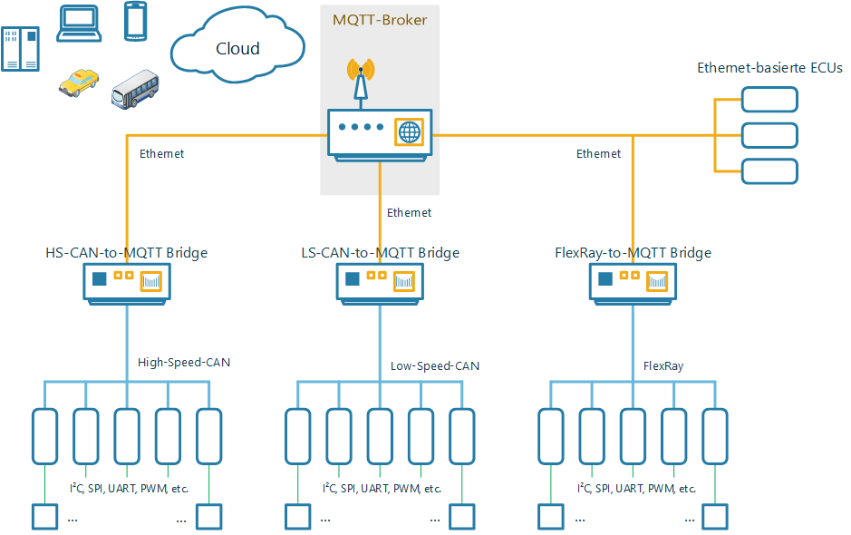
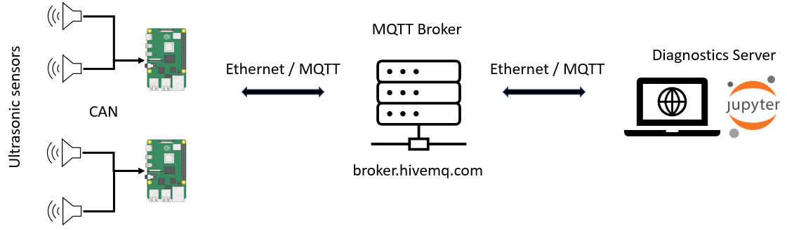

**[Introduction](#introduction)** |
**[MQTT-based E/E architecture](#mqtt-based-ee-architecture)** |
**[Prerequisites](#prerequisites)** |
**[Installation](#installation)** |
**[Usage](#usage)** |

# HSmartKArt-EE

**HSmartKArt-EE** provides an approach for mastering the challenges of future vehicle systems.
Connected Cars, autonomous driving and other functions that will shape the future of cars all
rely on cloud-based services. Accordingly cross-domain communication is a demanding topic for
future vehicle systems. Additionally a centralized, zone-oriented topology is key to modern
E/E architectures. Core piece of this E/E architecture is the MQTT protocol.

The HSmartKArt is an electrical powered recumbent bike based on the commercially available
e.Go Kart. The functionality e.Go Kart will be expanded consecutively with driver assistance
systems. The E/E architecture providing the foundation for modern driver assitance systems and
other future vehicle systems is called HSmartKArt-EE and provided in this repository. It is
a reference deployment of an more generic design for an modern E/E architecture that is
briefly described in section 'MQTT-based E/E architecture'.

## Disclaimer

This software is not intended for use in public areas. It is just the subject of a study.


## Introduction

This repository is a reference deployment of an E/E architecture for future vehicle systems.
The MQTT/CAN Bridge publishes CAN data that will be distributed by the MQTT Broker. Receiving
the CAN data is done by subscribing to the corresponding topic. Key components of this
reference deployment are:

* **MQTT/CAN Bridge**: MQTT client running on a Raspberry Pi with a CAN HAT. This device
  listens directly on the CAN bus. It grabs CAN frames and publishes them. So this is
  essentially a MQTT/CAN Bridge.

* **MQTT Broker**: A public MQTT broker (broker.hivemq.com) handling the distribution of
  messages throughout the connected clients.

* **Ubuntu Server**: A Host PC running a Jupyter Notebook Web Server. This can be used as a
  Workstation to visualize and analyze the CAN data.


## MQTT-based E/E architecture

Considering future vehicle systems following requirements are applying for E/E architectures:
1. Modulare, centralized topology
2. Efficient hardware and protocols
3. Cross-domain communication
4. Scalability

Based on this criteria the following design has been elaborated:


The reference deployment using Raspberry Pis as MQTT Bridges, a Laptop as Ubuntu Server and
the broker.hivemq.com as MQTT Broker has the following structure:



## Prerequisites

For the **MQTT/CAN Bridge** component a Raspberry Pi with a CAN HAT is needed. Alternatively
using a similar device running a Debian-based Linux distribution with a CAN interface is
possible. The CAN interface needs to be compatible with the SocketCAN Linux library.

When using a public **MQTT Broker** like the one provided by HiveMQ (broker.hivemw.com) no
setup is necessary. Only the URL of the Broker (and possibly the IP) is needed to establish a
connection to the Broker.

For the **Ubuntu Server** a Host PC (or Laptop) running the Ubuntu Server 20.04 OS is needed.
Also a public IPv4 address and/or a DNS with an A record for the public IP address needs to be
available.
**NOTE**:	When using Unitymedia Connect Box consider the setup of an Portmapper to avoid
			errors due to the IP policy of Unitymedia (DS Lite).


## Installation
To install the MQTT Bridge on the Raspberry Pi an installation script is provided. Also an
installation script for the Jupyter Noteboook Server running on a Host PC running the Ubuntu
Server OS is provided.

### Installation script for MQTT Bridge
For installation transfer the `install-mqtt-bridge.sh` file to the Raspberry Pi. To install
the software for the MQTT Bridge on a Raspberry Pi simply enter the following commands in the
command line:
```bash
sudo bash ./install-mqtt-bridge.sh
```
The script will install following comoponents:
1. Basic libraries and dependencies
2. Paho MQTT C Client library (https://www.eclipse.org/paho/index.php?page=clients/c/index.php)
3. The mqttee-bridge software

**NOTE**:	SocketCAN library for CAN communication is part of the Linux Kernel and needs no
			manual installation. See also https://en.wikipedia.org/wiki/SocketCAN for more
			information.

### Installation script for Jupyter Notebook Server
For installation transfer the `install-jupyter.sh` file (VERZEICHNIS MIT ABHÄNGIGKEITEN?????????????????????????????????????????????????) to the Host PC running Ubuntu Server
OS. Enter following command in the command line to install the Jupyter Notebook Server:
```bash
sudo bash ./install-jupyter.sh
```
The script will install following comoponents:
1. Basic libraries and dependencies
2. Certbot for SSL certificate
3. Nginx Web Server
4. Linux firewall setup (ufw)
5. Miniconda 3
6. JupyterLab (including Jupyter Server and Jupyter Notebook components)
7. Paho MQTT Python Client

The Jupyter Notebook Server is ready to use with a browser for developing applications
subscribing or publishing to CAN data topics or configuration topics and process the received
sensor data.

## Usage

### XML configuration file
The configuration of the MQTT Bridges is described using the
[Extensible Markup Language (XML)](https://www.w3.org/XML/).

The provided XML configuration file applies for a CAN-to-MQTT Bridge.

ABBILDUNG CAN-to-MQTT Bridge !!!!!!!!!!!!!!!!!!!!!!!!!!!!!!!!!!!!!!!!!!!!!!!!!!!!!!!!!!!!!!!!!!!!!!!!!!!!!!!!!!!!!!!!!!!!!!!!!!!!!!!!!!!!!!!!!!!!!!!!!!!!!!!!!!!!!!!!!!!!!!!!!!!!!

It describes the CAN frames available on the bus which have to be transmitted on a MQTT topic.
The topic on which the CAN frame will be published is automatically created using the
following pattern:
```bash
DEVICE/MODULE/LOCATION/dataCAN
```
The part in `UPPER CASE` is specified in the XML configuration file. See provided configuration
file for reference. These topics are customizeable by editing the configuration file and
updating the MQTT Bridge with the new file. The subtopic `dataCAN` is fixed and serves as
channel for CAN data traffic.

### MQTT Bridge
To start the MQTT Bridge software run the following command in the directory XYZDIRECTORY?????????????????????????????????????????????????????????????????????????????????????????????????????

#### Configuration update
To update the configuration of an MQTT Bridge simply transmit the new XML configuration file on
the configuration topic of the corresponding device. The device configuration topics have the
following pattern:
```bash
DEVICE/config
```
Like the pattern for the CAN data topics the `UPPER CASE` part is specified in the configuration
file and can be changed by editing the configuration file. The subtopic `config` is fixed and
serves as configuration channel.

**NOTE**:	The topic on which the new configuration file needs to be published is determined by
			the value of the <DEVICE> tag in the old configuration file.

### Jupyter Notebook Server
A Nginx Web Server is installed on the Host PC for SSL implementation. Nginx redirects the
incoming HTTPS traffic to the Jupyter Notebook Server.

The Jupyter Notebook Server is setup as a systemd service and will start automatically on
system startup. To use the Jupyter Notebook Server open a browser and enter the domain
associated with the IP adress of Ubuntu Server.
In a local environment the local IP address of the Ubuntu Server can be used.
