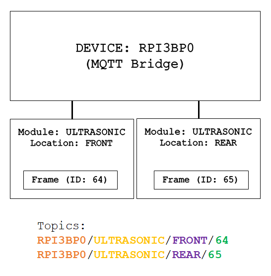
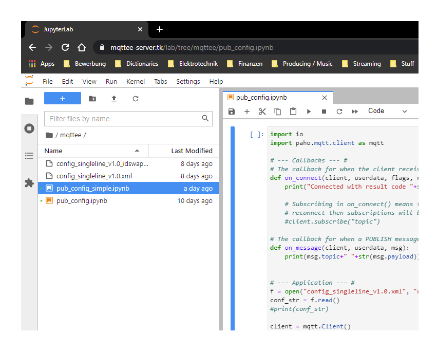

# HSmartKArt-EE

1. **[Introduction](#introduction)**
2. **[MQTT-based E/E architecture reference deployment](#mqtt-based-ee-architecture-reference-deployment)**
	1. **[Overview generic design](#overview-generic-design)**
	2. **[Reference deployment](#reference-deployment)**
3. **[Installation](#installation)**
	1. **[Prerequisites](#prerequisites)**
	2. **[Installation script for the CAN-to-MQTT Bridge](#installation-script-for-the-can-to-mqtt-bridge)**
	2. **[Installation script for the Server](#installation-script-for-the-server)**
4. **[Usage](#usage)**
	1. **[CAN-to-MQTT Bridge](#mqtt-bridge)**
		1. **[XML configuration file](#xml-configuration-file)**
		2. **[Configuration update](#configuration-update)**
	2. **[Server](#server)**
5. **[To-Do](#to-do)**


## Introduction

The HSmartKArt is an electrical powered recumbent bike based on the commercially available
e.Go Kart supplemented by student research projects on driver assistance systems. With
**HSmartKArt-EE** an E/E architecture is provided for this vehicle as the foundation for
modern driver assistance systems and cloud-based services.  
It is a reference deployment of a more generic design for a modern E/E architecture developed
in a student research project at the Karlsruhe University of Applied Sciences. Section
'MQTT-based E/E architecture reference deployment' describes the HSmartKArt-EE deployment and
gives a brief overview of the more generic E/E architecture design.

This repository contains two directories, each providing a installation script. One installs
a web server which hosts a JupyterLab environment for public access on an Ubunut Server OS.
The other is for a Debian-based Embbeded Linux device like the Raspberry Pi and installs all
components to run the software for a CAN-to-MQTT Bridge.


## MQTT-based E/E architecture reference deployment

### Overview generic design

Considering future vehicle systems following general requirements apply for E/E
architectures:
1. Modulare, centralized topology
2. Efficient hardware and protocols
3. Cross-domain communication
4. Scalability

To meet this demands the following design has been elaborated:


This is the generic design of an E/E architecture based on the MQTT protocol for future
vehicle systems. All components are located on the vehicle except ofr the cloud devices.Its
modulare and centralized structure, paired with the Bridges and the characteristics, of the
MQTT protocol compose an architecture suitable as a vehicle platform for sophisticated
networks. Global access of the data enables cloud-based services.

### Reference deployment
For the purpose of prototyping a Raspberry Pi is used as an embedded platform. Also a public
MQTT Broker provided by HiveMQ is used. The main components of the design are:
* **CAN-to-MQTT Bridge**: This device is a Raspberry Pi with a CAN HAT. It listens directly on
	the	CAN bus and grabs CAN frames. The frames can be processed and/or published. Which CAN
	frames the device publishes is configured by a XML configuration file. So this device is
	essentially a CAN-to-MQTT Bridge.

* **MQTT Broker**: An implementation of a local but publicly accessable Broker as proposed in
	the generic design is currently not included in this repository. Eclipse Mosquitto could be
	used as a local Broker.	Unfortunately the configuration of all the network components to
	make the Broker accessible from the outside of the local area network is currently not
	finished and therefore not included in this repository. For the purpose of prototyping a
	public MQTT Broker running on the HiveMQ platform (http://www.mqtt-dashboard.com/) is used
	for handling the distribution of messages throughout the connected clients. The public
	Broker is used to evaluate the global access of the CAN data.


## Installation
To install the CAN-to-MQTT Bridge on the Raspberry Pi an installation script is provided. Also
an installation script for hosting the Jupyter Noteboooks from a server is provided. The server
may be used to develop Python applications for analyzing, visualizing and recording the CAN
data received with the Paho MQTT Python library.

The installation scripts are interactive so be aware that user input is required at certain
points of the installation. For the CAN-to-MQTT Bridge installation script following user input
is required:
* MQTT Client ID
For the Server installtion script follwoing user input is required:
* The certbot tool needs some user information to create a certificate
* Password for JupyterLab

### Prerequisites

For correct execution of the installation scripts make sure the following environment variables
are set appropriately:
* `USER`: the system user (with sudo privileges) that will be the owner of the JupyterLab
	service. Normally set by system.
* `HOME`: the home directory of `USER`. This will be the installation directory and the default
	directory when entering the JupyterLab environment. Normally set by system.
* `MQTT_CLIENTID`: the MQTT client id used for the CAN-to-MQTT Bridge. This environment
	variable needs to be set manually. To make sure the environment variable is set on system
	startup the script `mqttclientid.sh` is placed in the directory `/etc/profile.d/` during
	installation.

For the **CAN-to-MQTT Bridge** component a Raspberry Pi is needed, CAN HAT optional. With some
small fixes in the installation script can be used for similar devices with a CAN interface
running a Debian-based Linux distribution:
* CAN Interface Setup needs to be modified according to the used device
* The CAN interface needs to be compatible with the SocketCAN Linux library

For the **MQTT Broker** no additional setup is needed when using the HiveMQ platform.

For the **Server** a host PC (or Laptop) running the Ubuntu Server 20.04 OS is needed. Also a
public IPv4 address and/or a domain (DNS with an A record for the public IP address) needs to
be associated with the server. Without public IPv4 or domain the certificate generation will
fail because certbot cannot perform the http challenges.  
**NOTE**: When using Unitymedia Connect Box consider the setup of a Portmapper to avoid errors
due to the IP policy of Unitymedia (Dual-Stack Lite).

**NOTE**: The script will not update the software after installation. So updating the Paho MQTT
C library or the MQTT_CLIENTID environment variable needs to be done manually.

### Installation script for the CAN-to-MQTT Bridge
To install the software for the CAN-to-MQTT Bridge on a Raspberry Pi simply enter the following
commands in the command line:
```bash
sudo bash ./install-mqtt-bridge.sh
```
The script will execute following steps:
1. Install basic libraries and dependencies
2. Download, compile and install Paho MQTT C client library (https://www.eclipse.org/paho/index.php?page=clients/c/index.php)
3. Setup PICAN2 HAT
4. Install SocketCAN library
5. Set environment variable for MQTT client ID (user input required)
6. Compile mqttee-bridge sources

### Installation script for the Server
To install the server software on a Host PC running Ubuntu Server OS enter following command:
```bash
sudo bash ./install-server.sh
```
The script will install following comoponents:
1. Basic libraries and dependencies
2. Certbot for SSL certificate
3. Nginx Web Server
4. Linux firewall setup (ufw)
5. Miniconda 3
6. JupyterLab (including Jupyter Server and Jupyter Notebook components)
7. Paho MQTT Python client library

After the installation script is finished the Nginx and JupyterLab configurations need to be
edited to serve Jupyter Notebooks. Therefore templates are provided in the directory
`server/jupyter`. The `jupyter.conf` is moved to the `/etc/nginx/sites-available` directory
during installation and `jupyter_lab_config.py` is moved to `~/.jupyter`. Edit the templates
in the `/etc/nginx/sites-available` and `~/.jupyter` directory respectively. These templates
include a `<placeholder>` which needs to be replaced with the appropriate value:
* `<server-domain.com>`: Replace it with the domain or IP address on which the server is
accessible, i.e. `mqttee-server.com`. 

Save the modified templates and run following command:
```bash
sudo ln -s /etc/nginx/sites-available/jupyter.conf /etc/nginx/sites-enabled/
```
Restart the Nginx and JupyterLab services
```bash
sudo systemctl restart nginx
sudo systemctl restart jupyterlab
```
or reboot the system to apply the configuration.

To use the Server simply open a browser and enter the Domain or IP address of the server. For
developing applications use the Paho MQTT Python library to subscribe on or publishing to
the topics associated to the CAN-to-MQTT Bridge. For more information on the specification of
topics associated to a device see section 'XML configuration file'.


## Usage

### CAN-to-MQTT Bridge
To start the CAN-to-MQTT Bridge software change into the installation directory (directory
where the install-mqtt-bridge.sh script has been executed). This is where the compiler will put
the executable output file if the installation script is successcully completed. In this
directory run the following command to print a description of the available options:
```bash
./mqttbridge -h
```
To operate as CAN-to-MQTT Bridge run
```bash
./mqttbridge -c "true"
```

#### XML configuration file
The configuration of the CAN-to-MQTT Bridges is described using the
[Extensible Markup Language (XML)](https://www.w3.org/XML/). The provided XML configuration
file `config.xml` applies for a CAN-to-MQTT Bridge. It has only one line. For easy reading the
`config_formatted.xml` file is provided.

Following figure shows the structure behind the configuration file:



The configuration file describes the device running the CAN-to-MQTT Bridge and the modules
connected to it. The modules are the sensors or ECUs connected to the CAN bus. Each module is
described by a name and its location on the vehicle. The section `<FRAME>` describes the
mapping of the sensor signals into the CAN frames of the module. A module may contain multiple
`<FRAME>` sections. Each section describes the mapping of a CAN frame that will be read from
the bus and transmitted on a MQTT topic. The topic is automatically created using the following
pattern:
```bash
DEVICE/MODULE/LOCATION/dataCAN
```
The subtopics in UPPER CASE are specified in the XML configuration file. See provided
configuration file for reference. These topics are customizable by editing the configuration
file and updating the CAN-to-MQTT Bridge with the new file. The subtopic `dataCAN` is fixed and
serves as channel for CAN data traffic. For example, to configure the bridge to publish the
CAN data on the topic `RPI/ULTRASONIC/REAR/dataCAN` set/modify the appropriate values for the
XML tags:
* `<DEVICE-NAME>RPI</DEVICE-NAME>`, `<MODULE-NAME>ULTRASONIC</MODULE-NAME>` and
`<LOCATION>REAR</LOCATION>`

#### Configuration update
To update the configuration of an CAN-to-MQTT Bridge simply publish the new XML configuration
file on the configuration topic of the corresponding device. The device will automatically
apply the received configuration file and resume to normal operation, transmitting the CAN
frames specified in the new configuration file on the topic `DEVICE/MODULE/LOCATION/dataCAN`.
The device configuration topics have the following pattern:
```bash
DEVICE/config
```
Like the pattern for the CAN data topics the UPPER CASE part is specified in the configuration
file and can be changed by editing the configuration file. The subtopic `config` is fixed and
serves as configuration channel.

**NOTE**: The topic on which the new configuration file needs to be published is determined by
the value of the XML tag `<DEVICE>` in the old configuration file.

### Server
To use the server for developing Python applications with JupyterLab open a browser and enter
the domain or IP address of the Ubuntu Server. In a local environment the local IP address of
the Ubuntu Server can be used.

The login prompt when entering the server domain or IP in a browser; in this case a domain has
been set up for the server:


This is the JupyterLab GUI:



## To-Do
* Develop dedicated hardware for MQTT Bridges
* Add support for multiple CAN frames in single MQTT message
* GUI for creating and maintaining XML configuration files
* Docker Application for high portability
* Use CAN ID filter